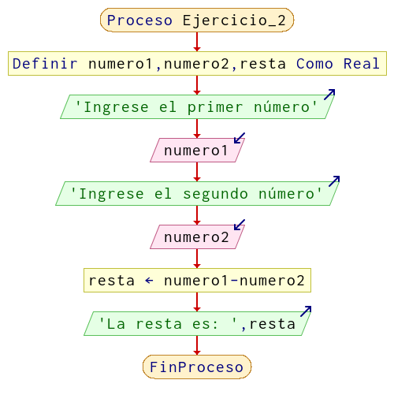

# Ejercicio 2

Realizar un algoritmo en diagrama de flujo (DF) para restar dos números.

## Solución

**Diagrama de flujo:**



**Resolución en pseint:**

```
Proceso Ejercicio_2
	Definir numero1,numero2,resta Como Real
	Escribir 'Ingrese el primer número'
	Leer numero1
	Escribir 'Ingrese el segundo número'
	Leer numero2
	resta <- numero1-numero2
	Escribir 'La resta es: ',resta
FinProceso
```

**Resolución en C**

```c
#include <stdio.h>

int main()
{
    float numero1, numero2, resta;
    printf("Ingrese el primer numero:\n");
    scanf("%f",&numero1);
    printf("Ingrese el segundo numero:\n");
    scanf("%f",&numero2);
    resta = numero1-numero2;
    printf("La resta es: %.2f\n",resta);

    return 0;
}
```