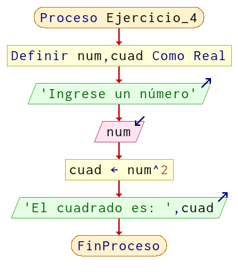

# Ejercicio 4

Realizar un algoritmo en DF que, al leer un número, calcule la potencia cuadrada de dicho número y muestre el resultado.

## Solución

**Resolución en pseint:**

```
Proceso Ejercicio_4
	Definir num,cuad Como Real
	Escribir 'Ingrese un número'
	Leer num
	cuad <- num^2
	Escribir 'El cuadrado es: ',cuad
FinProceso
```

**Diagrama de flujo:**

