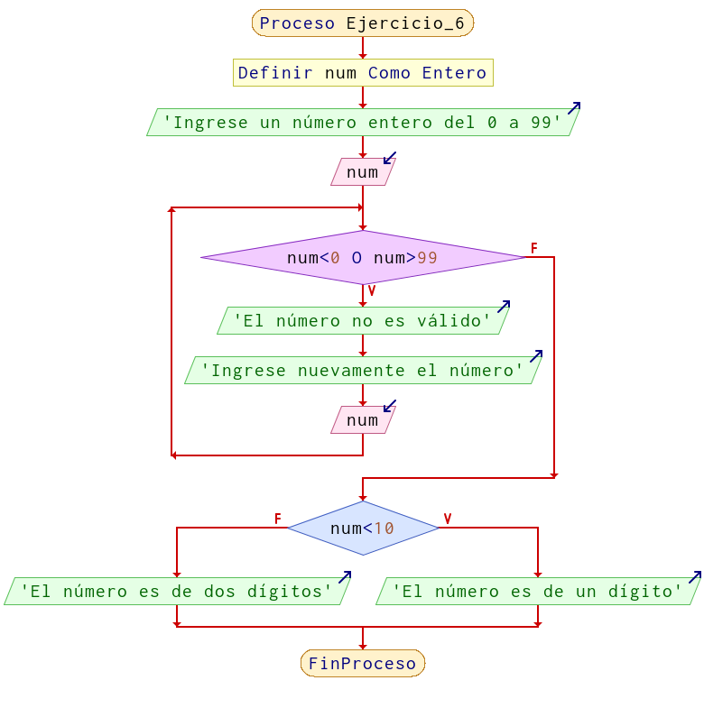

# Ejercicio 6

Expresar un algoritmo que al ingresar un número entero me indique si es de un dígito o de dos dígitos:

NOTA: un dígito es del 0 al 9. Dos dígitos del 10 al 99. No se pueden ingresar números menores a cero y mayores a noventa y nueve.

## Solución

**Resolución en pseint:**

```
Proceso Ejercicio_6
	Definir num Como Entero
	Escribir 'Ingrese un número entero del 0 a 99'
	Leer num
	Mientras num<0 O num>99 Hacer
		Escribir 'El número no es válido'
		Escribir 'Ingrese nuevamente el número'
		Leer num
	FinMientras
	Si num<10 Entonces
		Escribir 'El número es de un dígito'
	SiNo
		Escribir 'El número es de dos dígitos'
	FinSi
FinProceso
```

**Diagrama de flujo:**

